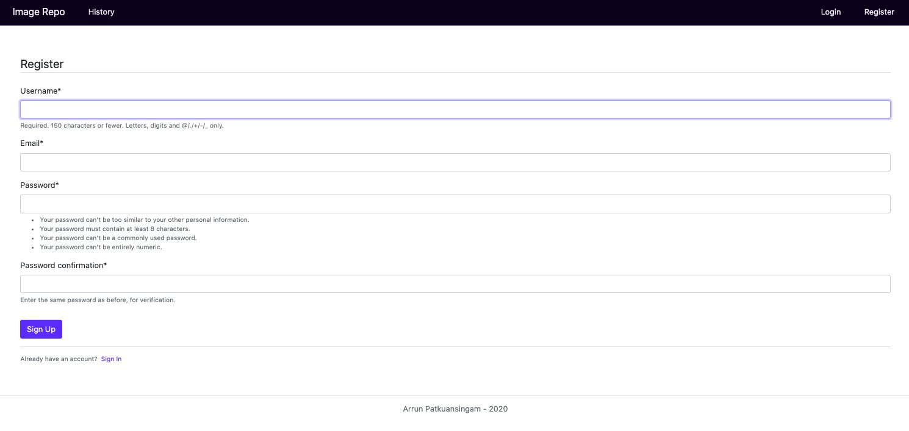
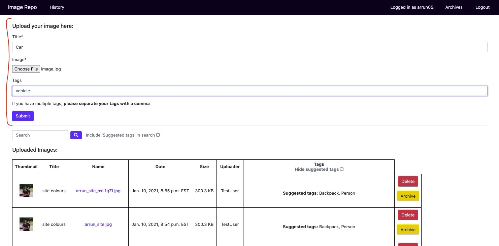
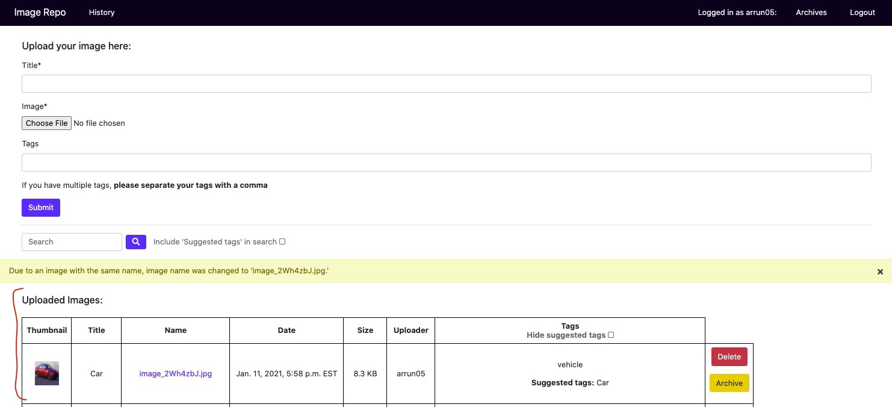
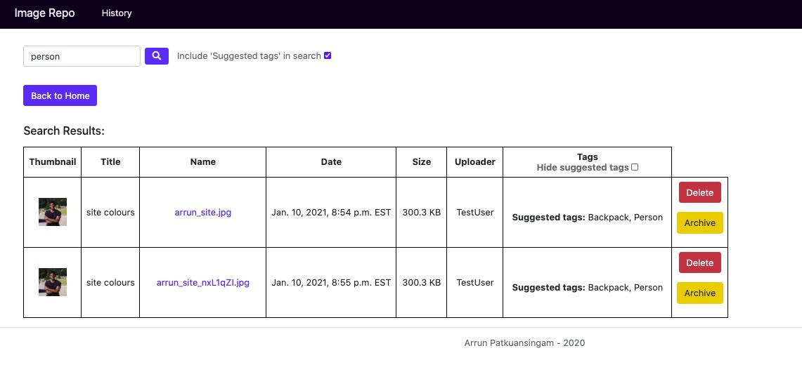
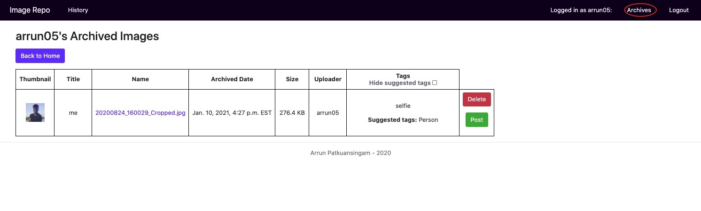
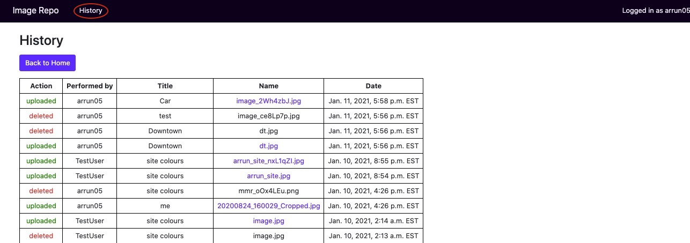
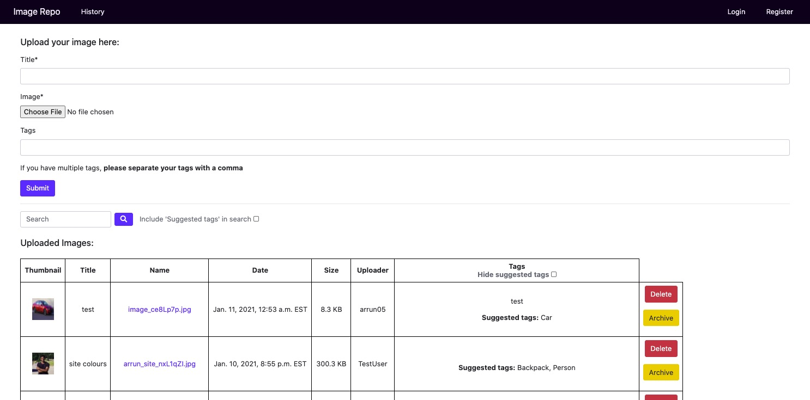

# Shopify Image Repo

Image repo application built using Django and Python. Users can upload images, download, archive and search for images that have been uploaded into the repo. Using object detection (cvlib by default and Google Vision API if the credentials are provided), the image will also have suggested tags attached to it that users can use to find the uploaded images. If necessary, image repo storage can be moved to AWS S3. **Notes about adding Google Vision API and S3 bucket credentials in last section of README.

<u><h2>Table of Contents</h2></u>
<ol>
<li>Instructions for running the program from repo</li>
    <ul>
        <li>Starting using the bash script</li>
        <li>Manual start</li>
    </ul>
<li>Quick instructions on using the application</li>
<!--
<li>Different sections of the application</li>
    <ul>
        <li>Home Page</li>
        <li>Register</li>
        <li>Login</li>
        <li>History</li>
        <li>Archives</li>
    </ul>
-->
<li>AWS S3 and Google Vision API</li>
</ol>

<h2>1) Instructions for running the program from repo:</h2>

Application requires Python (v3.7.3 or higher)

<u>Starting using the bash script:</u>
    <ol>
    <li>Download/clone repo (can download as ZIP)</li>
    <li>In your terminal enter the main directory of the folder “shopify_image_repo”</li>
    <li>Run 'chmod u+x start.sh'</li>
    <li>Run './start.sh' or 'bash start.sh'</li>
    <li>In your browser go to http://127.0.0.1:8000</li>
    </ol>

<u>Manual start:</u>
    <ol>
    <li>Download/clone repo (can download as ZIP)</li>
    <li>In your terminal enter the main directory of the folder “shopify_image_repo”</li>
    <li>Run 'pip3 install -r requirements.txt —user'</li>
    <li>Run 'python3 image_repo/manage.py makemigrations'</li>
    <li>Run 'python3 image_repo/manage.py migrate'</li>
    <li>Run 'python3 image_repo/manage.py runserver'</li>
    <li>In your browser go to http://127.0.0.1:8000</li>
    </ol>

 
<h2>2) Quick instructions on using the application</h2>
<ol>
<li>When the application first opens, click Register in the top right corner</li>

<li>Create an account <strong>(ex. username: TestUser, password: Testing321)</strong></li>

<li>Login to the account just created (will be automatically redirected however can also use 'Login' link in top toolbar)</li>

<li>In the top half of the home page there will be a form to submit an image (choose a Title, add an image and add tags (tags are optional)). Click Submit.</li>

<li>The image will appear in the table in the bottom half of the home page. From here you can delete it or archive it. You will not be able to perform these for images you did not upload.</li>

<li>To download the image, open the image by clicking it's link in the 'Name' column. It will open in a new tab, right click on it and 'Save Image As'</li>
<li>You can search for images in the search bar above the table using the image's title, name, or tags (suggested tags are tags generated by object detection - to include them in your search, check the checkbox beside the search field)</li>

<li>After deleting an image it will no longer be available. After archiving an image it will be available in your 'Archive' section (can be accessed through the top toolbar). You can repost them from your archive if you wish.</li>

<li>The 'History' section in the top left provides a log of what images have been uploaded/deleted and by who.</li>

</ol>
 
<!--
<h2> 3) Different sections of the application</h2>
-
<u><h3>Home Page</h3></u>
-

When first entering the site, the home page shows the image submission form at the top and the images that have been uploaded in the bottom half. When trying to submit an image without logging in, it will redirect the user to the log in page. The login page can also be accessed by clicking the 'Login' option in the top right corner. 

-

To register as a new user, click 'Register' in the top tool bar.

After registering and logging in you can upload an image. You will need a title and an image. You can also add tags to aid in search for the image later however tags are optional.

-->
<h2>3) AWS S3 and Google Vision API</h2>