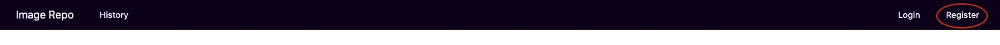
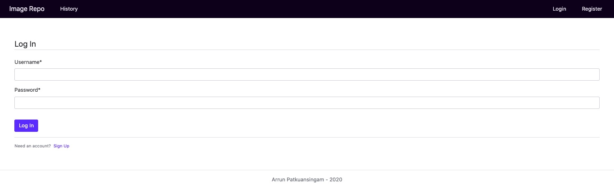
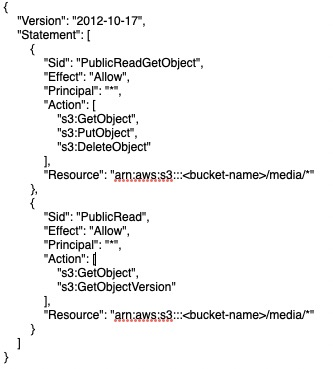
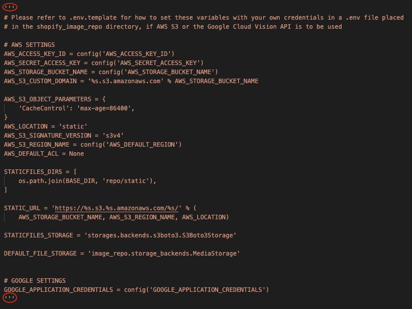

# Shopify Image Repo

Link: <a href="http://imagerepoapp.herokuapp.com/">imagerepoapp.herokuapp.com</a>

Please feel free to create your own account or use the sample account below to log in!

Username: Test_User

Password: Testing321

<u><h2>Table of Contents</h2></u>
<ol>
<li>Introduction</li>
<li>Quick instructions on using the application</li>
<li>Instructions for running the program from the repo</li>
    <ul>
        <li>Starting using the bash script</li>
        <li>Manual start</li>
    </ul>
<!--
<li>Different sections of the application</li>
    <ul>
        <li>Home Page</li>
        <li>Register</li>
        <li>Login</li>
        <li>History</li>
        <li>Archives</li>
    </ul>
-->
<li>AWS S3 and Google Vision API</li>
</ol>

<h2>1) Introduction:</h2>

Image repo application built using Django and Python. Users can upload images, download, archive and search for images that have been uploaded into the repo. Using object detection (cvlib by default and Google Vision API if the credentials are provided), the image will also have suggested tags attached to it that users can use to find the uploaded images. If necessary, image repo storage can be moved to AWS S3. **Notes about adding Google Vision API and S3 bucket credentials in last section of README.

<h2>2) Quick instructions on using the application</h2>
    <ol>
    <li>When the application first opens, click Register in the top right corner</li>
    
    <li>Create an account <strong>(ex. username: TestUser, password: Testing321)</strong></li>
    
    <li>Login to the account just created (will be automatically redirected however can also use 'Login' link in top toolbar)</li>
    
    <li>In the top half of the home page there will be a form to submit an image (choose a Title, add an image and add tags (tags are optional)). Click Submit.</li>
    
    <li>The image will appear in the table in the bottom half of the home page. From here you can delete it or archive it. You will not be able to perform these for images you did not upload.</li>
    
    <li>To download the image, open the image by clicking it's link in the 'Name' column. It will open in a new tab, right click on it and 'Save Image As'</li>
    <li>You can search for images in the search bar above the table using the image's title, name, or tags (suggested tags are tags generated by object detection - to include them in your search, check the checkbox beside the search field)</li>
    
    <li>After deleting an image it will no longer be available. After archiving an image it will be available in your 'Archive' section (can be accessed through the top toolbar). You can repost them from your archive if you wish.</li>
    
    <li>The 'History' section in the top left provides a log of what images have been uploaded/deleted and by who.</li>
    
    </ol>
 
<!--
<h2> 3) Different sections of the application</h2>
-
<u><h3>Home Page</h3></u>
-

When first entering the site, the home page shows the image submission form at the top and the images that have been uploaded in the bottom half. When trying to submit an image without logging in, it will redirect the user to the log in page. The login page can also be accessed by clicking the 'Login' option in the top right corner. 

-

To register as a new user, click 'Register' in the top tool bar.

After registering and logging in you can upload an image. You will need a title and an image. You can also add tags to aid in search for the image later however tags are optional.

-->

<h2>3) Instructions for running the program from the repo:</h2>

Application requires Python (v3.7.3 or higher)

<u>Starting using the bash script:</u>
    <ol>
    <li>Download/clone repo (can download as ZIP)</li>
    <li>In your terminal enter the main directory of the folder “shopify_image_repo”</li>
    <li>Run 'chmod u+x start.sh'</li>
    <li>Run './start.sh' or 'bash start.sh'</li>
    <li>In your browser go to http://127.0.0.1:8000</li>
    </ol>

<u>Manual start:</u>
    <ol>
    <li>Download/clone repo (can download as ZIP)</li>
    <li>In your terminal enter the main directory of the folder “shopify_image_repo”</li>
    <li>Run 'pip3 install -r requirements.txt —user'</li>
    <li>Run 'python3 image_repo/manage.py makemigrations'</li>
    <li>Run 'python3 image_repo/manage.py migrate'</li>
    <li>Run 'python3 image_repo/manage.py runserver'</li>
    <li>In your browser go to http://127.0.0.1:8000</li>
    </ol>

 

<h2>4) AWS S3 and Google Vision API</h2>

Due to security concerns, the AWS S3 (for image storage) and the Google Vision API (for image object detections) credentials could not be provided in the repo. As a default, the application uses local file storage for storing the images and uses the Python library 'cvlib' for object detection.

An .env.template for what credentials need to provided for these services is provided as the settings.py file (the file that sets the settings for Django) will be reading these credentials from a .env file in the home ('shopify_image_repo') directory.

The fields underlined in red would have to be put in to a new .env file in the home directory.

Those that begin with 'AWS' handle AWS S3 access and the field that starts with 'GOOGLE' is the name of the service account key json file for the Google Vision API (this file should be placed in '/shopify_image_repo/image_repo/ (the same directory as manage.py). For instructions on how to get the Google Vision API Service Account JSON key <a href="https://daminion.net/docs/topics/auto-tagging/how-to-get-google-cloud-vision-api-key/">follow these instructions.</a>

For instructions on how to get the AWS credentials <a href="https://testdriven.io/blog/storing-django-static-and-media-files-on-amazon-s3/">follow these instructions.</a> However, make the Bucket public and change the Bucket Policy to: 

The CORS Config to:

And the User Policy to:

These policy changes limit the users access to the bucket.

Once the credentials are provided and added in the .env file, they can be called into the settings file by uncommenting these lines in the settings.py file.

